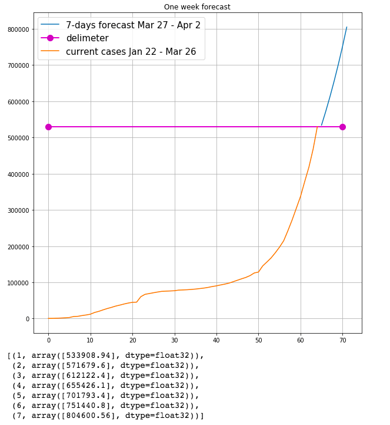

# covid_19_forecast
COVID-19 infection forecast (r_naught/growth rate)

**Implementation: PyTorch 1.2**

### Motivation
Forecast potential upcomming new COVID-19 inefction cases. 

### Dataset
https://www.kaggle.com/sudalairajkumar/novel-corona-virus-2019-dataset/data

### Resources

[Link2](https://towardsdatascience.com/machine-learning-finds-just-how-contagious-r-naught-the-coronavirus-is-852abf5f0c88)

[Link1](https://towardsdatascience.com/modeling-exponential-growth-49a2b6f22e1f)

### March 27th - April 2nd Forecast

